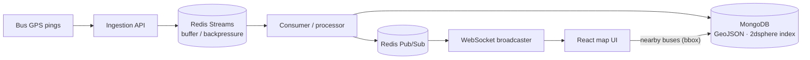

# Delhi Transit — Real-Time Bus Tracking


> A high-throughput pipeline that ingests live GPS pings from city buses, answers "what's near me?" geospatial queries in **under 50 ms**, and streams live positions to the browser with **sub-100 ms** latency.

The core idea: **decouple ingestion from storage and delivery** so a flood of GPS updates never blocks reads or the broadcast layer.

---

## Architecture



## Engineering highlights

- **Redis Streams ingestion** decouples raw location writes from persistence, absorbing burst traffic without blocking the event loop.
- **Geospatial queries** via MongoDB `2dsphere` indexes on GeoJSON points — bounding-box "buses near me" lookups in **< 50 ms**.
- **Live broadcast** over **WebSockets + Redis Pub/Sub**, streaming coordinates to the frontend at **sub-100 ms** latency.

## Tech stack

**Backend:** Node.js, Redis (Streams + Pub/Sub), MongoDB (GeoJSON / 2dsphere), WebSockets (`ws` / Socket.io — *[FILL IN]*)
**Frontend:** React *([FILL IN: map library — Leaflet / Mapbox / Google Maps])*

## Getting started

> *[FILL IN] — confirm against your repo.*

### Prerequisites
- Node.js 18+ · Redis · MongoDB

### Setup

```bash
git clone https://github.com/AnirudhChandan/Delhi-Transit.git
cd Delhi-Transit

# Backend
cd backend && npm install        # [FILL IN: confirm folder name]
# create .env (see below)
npm run dev

# Frontend
cd ../frontend && npm install
npm run dev
```

Example `.env` *([FILL IN] real keys):*

```env
PORT=4000
MONGO_URI=mongodb://127.0.0.1:27017/delhi_transit
REDIS_URL=redis://127.0.0.1:6379
```

### Seeding GPS data
*[FILL IN] — how do buses get simulated/seeded? (e.g., a script that replays a GTFS feed or emits synthetic pings.)*

## Repository layout
```
Delhi-Transit/
├── backend/      # [FILL IN]
└── frontend/     # [FILL IN]
```

## What I learned
Stream-based ingestion vs. naive writes, geospatial indexing tradeoffs, and fan-out broadcasting to many WebSocket clients without head-of-line blocking.

## License
MIT
