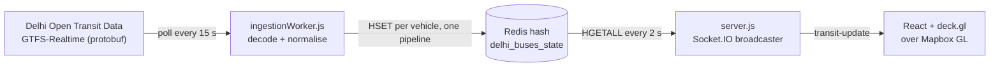

# Delhi Transit — Live Bus Map

A real-time map of Delhi's buses, fed by the city's open GTFS-Realtime feed.
An ingestion worker decodes the feed into Redis; a Socket.IO server pushes
snapshots to a React + deck.gl map.

## How it works



## Design notes

- **Ingestion and delivery are separate processes** that only share Redis.
  The worker can stall, crash or restart without dropping a single client
  connection; clients keep receiving the last known state.
- **Redis hash keyed by vehicle id** gives last-write-wins state per bus, and
  the whole city is one `HGETALL` per broadcast tick. Writes go through a
  single pipeline per poll.
- **Bad input is contained.** A poll returning fewer than 10 vehicles is
  treated as a truncated feed and skipped; records that fail to parse or have
  no coordinates are dropped at broadcast time instead of crashing the loop.
- **Smooth movement from coarse data.** The feed updates every ~15 s, so the
  map uses deck.gl position and bearing transitions to animate buses between
  snapshots. Clicking a bus shows its route.

## Known limitations

Written down on purpose — these are the next things to fix:

- Every client receives the full city snapshot every 2 s. No viewport
  filtering and no deltas, so payload size grows with fleet size, not with
  what the user is looking at.
- Vehicles are never expired from the hash; a bus that stops reporting stays
  on the map at its last position.
- Single Redis instance, no auth, CORS open, socket URL hard-coded to
  `localhost:4000`.
- No tests.

## Run it locally

Needs Node 20+, a local Redis on the default port, and a Mapbox token.

```bash
# backend
cd transit-pulse-backend
npm install
cp .env.example .env        # add DELHI_OTD_API_KEY (https://otd.delhi.gov.in)
node ingestionWorker.js     # terminal 1
node server.js              # terminal 2

# frontend
cd ../transit-pulse-frontend
npm install
echo "VITE_MAPBOX_ACCESS_TOKEN=your_token" > .env.local
npm run dev
```

## Stack

Node.js, Express, Socket.IO, Redis, `gtfs-realtime-bindings` · React, deck.gl,
Mapbox GL, Zustand, Vite
